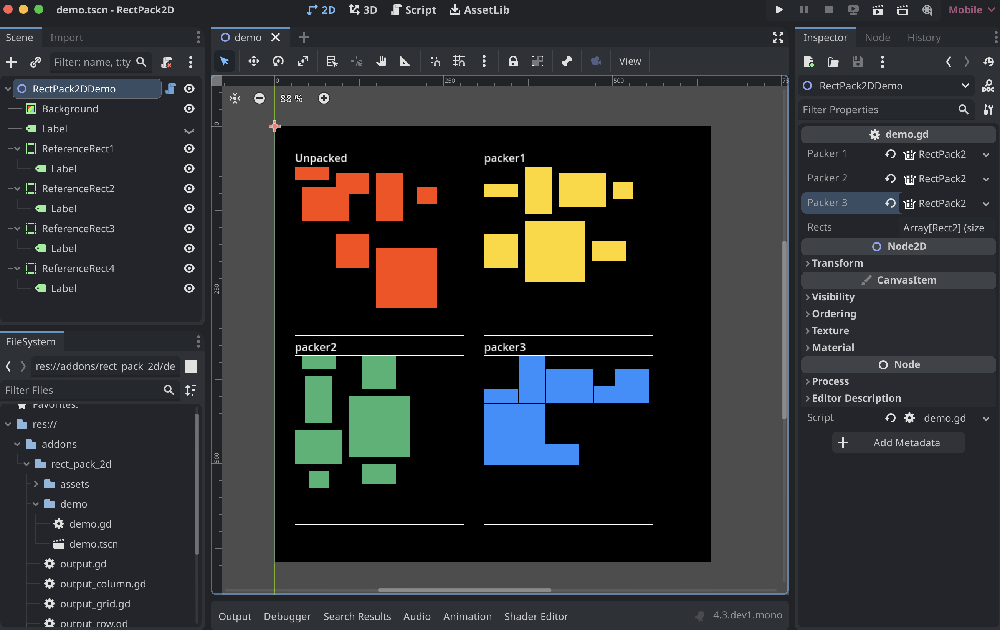

#  RectPack2D
### A plugin for Godot 4 to pack rectangles in a grid, preserving the order



This is a screenshot of the demo. In the demo, 7 rectangles are fed to three different rectangle packers. The results from these packers are then rendered using different colors. The set of red rectangles (top left) is unpacked.

## Installation
Installation is the same as any other Godot plugin from GitHub.

### 1. Clone this repo to your project's `addons` folder.
I recommend using a git submodule to clone:
```bash
cd your_project/addons
git submodule add https://github.com/kibble-cabal/rect-pack-2d.git rect_pack_2d
git submodule update --init
```
Otherwise, you can:
1. Clone the normal way
```bash
cd your_project/addons
git clone https://github.com/kibble-cabal/rect-pack-2d.git rect_pack_2d
```
2. Download a ZIP file


<details>
<summary><h4>If you only want the essential files…</h4></summary>

I have also provided the `cleaned` branch, which removes `README.md`, `screenshot.png`, `icon_grey.png`, and the `demo` folder.
Feel free to use either of these commands instead, if you'd like:
```bash
# Using submodules
cd your_project/addons
git submodule add -b cleaned https://github.com/kibble-cabal/rect-pack-2d.git rect_pack_2d
git submodule update --init
```
```bash
# Cloning
cd your_project/addons
git clone -b cleaned https://github.com/kibble-cabal/rect-pack-2d.git rect_pack_2d
```
</details>

### 2. In your project settings, enable the `RectPack2D` plugin.

## Example

```gdscript
extends Node2D

func _draw() -> void:
    var packer := RectPack2D.new()
    var rects: Array[Rect2] = [
        Rect2(0, 0, 100, 100),
        Rect2(100, 100, 150, 50),
        Rect2(200, 200, 25, 100)
    ]
    var output := packer.pack(rects)
    for rect in output.get_rects():
        draw_rect(rect, Color(randf(), randf(), randf()))
```

You can also check out the `demo` folder for a more complex example.

## Roadmap
* Nested grids, to remove the empty spaces
* Reordering (by size, shape, etc.) to pack more intuitively and tightly